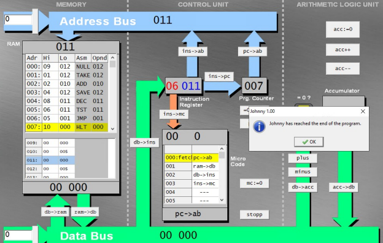
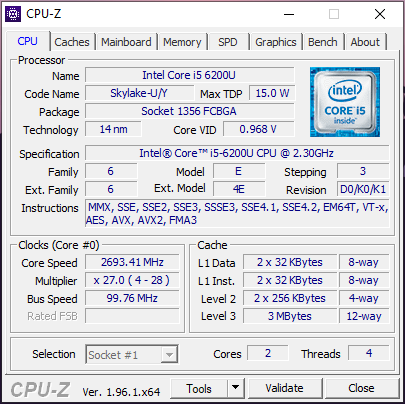
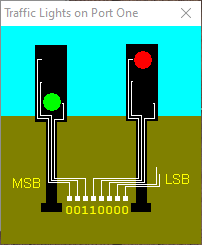
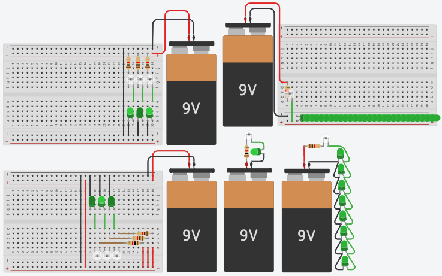

<h1 align="center">
    
</h1>
<h3 align="center">
    
    Arquitetura de Computadores do Século XXI
    
</h3>

<p align="center">
    
    
    
    <a href="https://github.com/Descomplica-ADS/ACSXXI/blob/master/LICENSE">
        
    </a>
</p>
<p align="center">
    <a href="#acs-xxi-">Projetos</a>&nbsp;&nbsp;&nbsp;|&nbsp;&nbsp;&nbsp;
    <a href="#tecnologias-">Tecnologias</a>&nbsp;&nbsp;&nbsp;|&nbsp;&nbsp;&nbsp;
    <a href="#screenshots-">Screenshots</a>&nbsp;&nbsp;&nbsp;|&nbsp;&nbsp;&nbsp;
    <a href="#licença-%EF%B8%8F">Licença</a>
</p>

# ACS-XXI ⚙
Projetos desenvolvidos durante as aulas do primeiro trimestre de Análise e Desenvolvimento de Sistemas da Faculdade Descomplica Digital.

## Tecnologias 🚀
Esses projetos foram desenvolvidos com as seguintes tecnologias:
- [BIOS Simulator](https://www.grs-software.de/sims/bios/phoenix/pages/)
- [Simulador de Defeitos Intel](https://www.baixesoft.com/download/simulador-de-defeitos-intel)
- [Logsim](https://sourceforge.net/projects/circuit/)
- [Simulador de Processador](http://tice.sea.eseo.fr/riscv/)
- [DrMIPS](https://brunonova.github.io/drmips/)
- [Little Man computer](https://peterhigginson.co.uk/lmc/)
- [Johnny](https://sourceforge.net/projects/johnnysimulator/)
- [SOsim](http://www.training.com.br/sosim/)
- [CPUID CPU-Z](https://www.cpuid.com/softwares/cpu-z.html)
- [MyCompiler](https://www.mycompiler.io/new/asm-x86_64)
- [Sms32v50](http://www.softwareforeducation.com/sms32v50/)
- [Tinkercad](https://www.tinkercad.com/)

## Screenshots 🚧
<div style="display: flex; flex-direction: 'column'; align-items: 'center';">
    
    
    
    
</div>
<a href="./.github/README-IMGS.md">Ver mais</a>

## Rodando os projetos 🚴🏻‍♂️
#### "Só vou dar uma olhadinha...":
Navegue entre as pastas das aulas e veja o readme do projeto.

#### Na sua maquina:
```bash
# Clone o repositório
$ git clone https://github.com/Descomplica-ADS/ACSXXI.git

# Acesse a pasta da aula e do projeto no prompt de comando
$ cd aula_01/bios_simulator
```

## Contribuição 💭
Para construir esses projetos tivemos a ajuda do **Profº Msc. Ubiratan Roberte Cardoso Passos** da Faculdade Descomplica que disponibilizou video aulas e a grande ajuda desta turma que se formou no *Discord*.
Quer [contribuir](./CONTRIBUTING.md) para algum projeto? Então envie seu Pull Request no repositório do projeto.

## Licença ⚖️
Estes projetos estão sob a licença do MIT. Veja o arquivo [LICENSE](https://github.com/Descomplica-ADS/ACSXXI/blob/master/LICENSE) para mais detalhes.