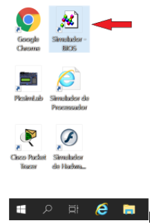
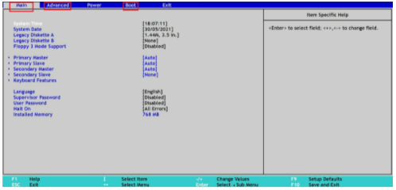

# Visão Geral da Arquitetura de Computadores
- 6/6 Vídeos
- 1/1 Texto
- 6/6 Questões
- 1/1 Atividade Prática

## Compreendendo o Setup da BIOS 📝

Objetivos: Compreender melhor o funcionamento da BIOS e seu papel na arquitetura computacional.
Materiais, Métodos e Ferramentas:
Para realizar essa prática o aluno precisará somente de um computador com acesso à internet

**Leia atentamente o texto a seguir.**

Computadores são formados por um conjunto de componentes interligados e que trocam dados entre si. Todos os componentes geralmente estão conectados através de uma placa mãe, que por sua vez é responsável não somente por garantir e manter os caminhos de comunicação, mas também fornecer outros recursos necessários para que tais componentes funcionem. 
Entretanto, até mesmo a placa mãe possui suas limitações, e para que possa realizar todas as tarefas que lhe são atribuídas, precisa de suporte de outros componentes, que são também partes da arquitetura do computador. Um desses componentes é a memória ROM. Nessa memória fica armazenado um pequeno sistema operacional chamado BIOS. Por este motivo, muitos chamam essa memória de memória BIOS, o que é um erro, uma vez que BIOS é o acrônimo de BASIC INPUT OUTPUT SYSTEM, ou Sistema Básico de Entrada e Saída. 
Este sistema armazena informações básicas sobre a placa mãe, suas configurações, restrições, além de que tipo de extensões pode receber, onde devem ser conectados e como podem ser acessados pelo Sistema Operacional que será utilizado pelo computador. 
Essa atividade será relacionada a este sistema, o BIOS. Para realizar esta atividade, vamos utilizar o simulador de BIOS conhecido como Phoenix BIOS Simulator. Pode ser acessado de qualquer computador ou celular, basta acessar este endereço web: https://www.grs-software.de/sims/bios/phoenix/pages/. 
Um atalho do endereço também estará disponível no computador remoto da Descomplica. Veja as instruções a seguir para acessar o simulador e realizar a atividade.

**Caso deseje acessar o simulador através do computador remoto da Descomplica, veja os passos a seguir.**

**1º. Passo) Acesse em seu computador (local) a Conexão de Área de Trabalho Remota com o endereço IP do computador remoto da Descomplica e clique em conectar.**
**Observação:** o endereço IP do computador remoto pode passar por atualização. Certifique-se com o professor tutor.

**2º. Passo) Abra o atalho do Simulador** - BIOS do computador remoto da Descomplica.

Ao abrir o aplicativo, a tela a seguir é apresentada.

A interface é simples e para essa atividade vamos nos preocupar somente com as abas *Main, Advanced e Boot.*

**3º. Passo) Realização da atividade:** Como dito anteriormente, o BIOS armazenado dentro da ROM, tem algumas funções muito importantes. Uma delas é o fornecimento de uma interface gráfica amigável com o usuário. Essa interface permite acessar e modificar alguns parâmetros do computador, interferindo inclusive em suas características.

Dentro do contexto do **SETUP da BIOS** do simulador, responda às seguintes perguntas:
1. ) Qual é a velocidade do processador que é apresentado no setup do simulador Phoenix BIOS Simulator (aba Advanced)?
2. ) Qual é a frequência dos barramentos PCI (aba Advanced)?
3. ) Qual é a capacidade de memória instalada (aba Main)?
4. ) Quais as opções de disco flexível que podem ser utilizadas (aba Main)?
5. ) Qual a sequência de boot configurada (aba Boot)?