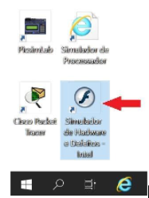
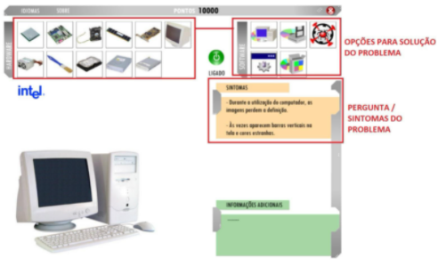
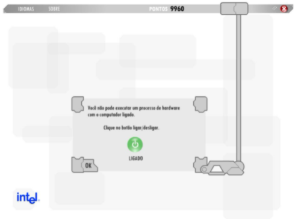

# Principais Tipos de Computação
- 5 Vídeos
- 1 Texto
- 6 Questões
- 1 Atividade Prática

## Solucionando Problemas de Hardware e Software 📝
**Objetivos:** Compreender melhor o funcionamento de cada um dos componentes do computador, entendendo inclusive a relação entre o hardware e o software. 
**Materiais, Métodos e Ferramentas:** Para realizar essa prática o aluno precisará somente de um computador com acesso à internet.

**Leia atentamente o texto a seguir.**

Compreender o funcionamento de um computador é extremamente importante em vários sentidos. Essa compreensão ajuda não somente no momento de definir a melhor arquitetura e combinação de componentes para que se possa “montar” uma máquina com uma boa relação custo-benefício, como também na busca por soluções para possíveis problemas que podem ocorrer ao longo da vida útil do equipamento. 
Ainda que não seja possível listar todos os possíveis problemas que um computador pode apresentar, muitos já são conhecidos ou, pelo menos, suas características fornecem ótimas sugestões do seu causador.

Para realizar esta atividade, vamos utilizar o aplicativo de simulação de defeitos da Intel. Se possível, instale a ferramenta em seu computador utilizando o link:
https://www.baixesoft.com/download/simulador-de-defeitos-intel

Esse aplicativo está no computador remoto que a Descomplica disponibiliza o acesso através da Conexão Remota.
Veja as instruções a seguir para acessar o aplicativo e realizar a atividade.

**1º. Passo) Acesse em seu computador (local) a Conexão de Área de Trabalho Remota com o endereço IP do computador remoto da Descomplica e clique em conectar.** 
**Observação:** o endereço IP do computador remoto pode passar por atualização. Certifique-se com o professor tutor.

**2º. Passo) Abra a ferramenta:** Simulador de Hardware e Defeitos - Intel

Ao abrir o aplicativo, imediatamente é apresentada uma tela já com o primeiro **defeito**. Além disso, a tela apresenta algumas opções de equipamentos de hardware e soluções de software para resolver o defeito. A tela apresentada é:

Observe que nessa tela existem alguns equipamentos de hardware, alguns ícones relacionados a softwares, um botão verde escrito **ligado**, um campo com os **sintomas**(que indica quais são os sintomas do problema) e também informações adicionais (preenchido quando necessário).

Existe também um campo que apresenta sua **pontuação**.

**3º. Passo) Propor uma solução:** Para sugerir/propor uma solução para o problema apresentado, basta clicar em um dos ícones de software ou de hardware. Ao clicar em um ícone, o aplicativo indica se a resposta está correta ou errada e também faz um comentário (feedback) da resposta. 
Quando a resposta está correta, sua pontuação aumenta, e um feedback positivo é apresentado, caso contrário, sua pontuação é reduzida, e um feedback sugerindo outra solução é apresentado. Um exemplo de feedback para uma resposta incorreta é apresentado a seguir.

**4º. Passo) Realizando a atividade:** A atividade é simples. O que se pede é que sejam respondidas **10 perguntas**. Escreva cada uma das perguntas em um arquivo de texto. Após a pergunta, comente sobre a dificuldade daquela pergunta para você