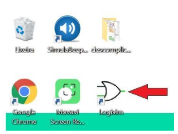
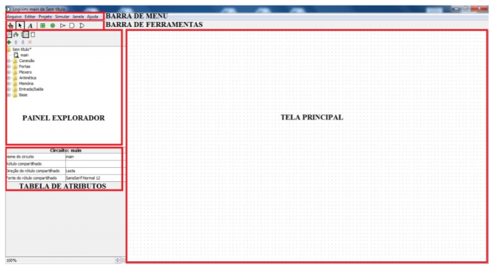
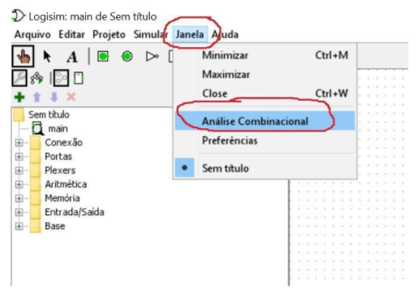
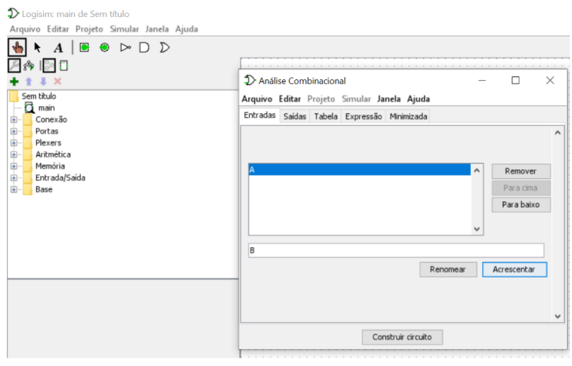
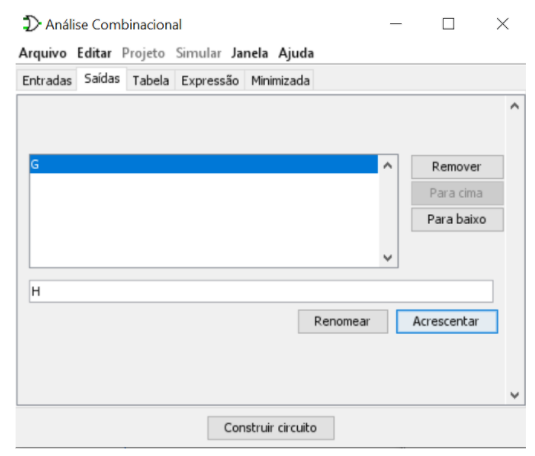
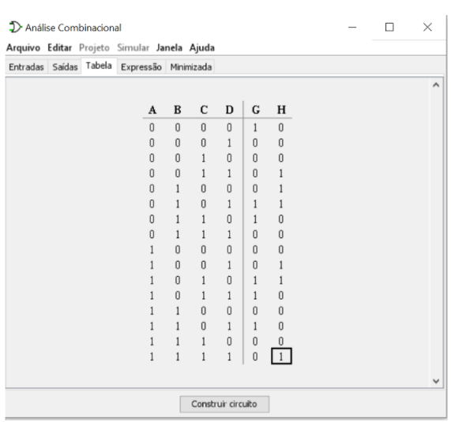
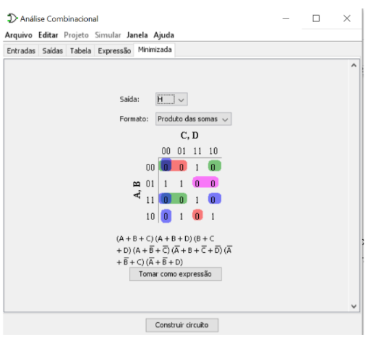
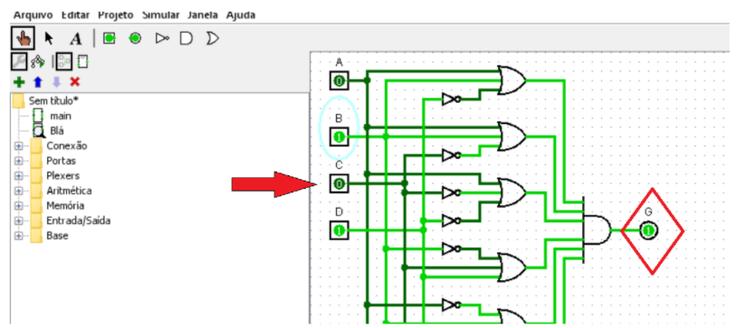

# Sistemas Numéricos em Arquitetura de Computadores
- 5 Vídeos
- 1 Texto
- 6 Questões
- 1 Atividade Prática

## Criação de Circuitos Lógicos com Base no Sistemas Binário 📝
Objetivos: Compreender a importância dos sistemas numéricos, sobretudo binários, na construção dos circuitos lógicos da arquitetura de um computador.
Materiais, Métodos e Ferramentas:
Para realizar essa prática o aluno precisará somente de um computador com acesso à internet e a ferramenta LogiSim.

**Leia atentamente o texto a seguir.**

Como sabemos a computação tem grande influência da matemática e eletrônica, principalmente no que diz respeito a circuitos digitais. A proximidade da informática com a eletrônica é tão grande que os mesmos conceitos relacionados a circuitos e lógica booleana são compartilhados por essas duas áreas. 
O princípio básico da computação é a presença ou ausência de carga elétrica em um determinado canal, 1 ou 0, presente ou ausente, verdadeiro ou falso. Essa característica dos circuitos está muito próxima do sistema binário, e esse é um dos motivos desse sistema ser tão amplamente utilizado na computação. 
Outra questão relacionada ao sistema binário, são suas compatibilidades com os sistemas octais e hexadecimais. Assim, mesmo que primitivamente não seja possível representar um dado com algo além de 1 e 0, em nível computacional, essas instruções podem ser reduzidas, basta somente convertê-las para o sistema octal ou hexadecimal. 
Compreender essa relação é fundamental para se tornar um bom profissional de tecnologia da informação, afinal, esta é uma área de grande abrangência. 

Para realizar esta atividade, vamos utilizar o aplicativo de simulação de circuitos lógicos **Logsim**. 
Se possível, instale o simulador em seu computador. Disponível em: https://sourceforge.net/projects/circuit/.

Este aplicativo também está no computador remoto da Descomplica, que disponibiliza o acesso através da Conexão Remota.

Veja as instruções a seguir para acessar o aplicativo e realizar a atividade.

**1º. Passo) Acesse em seu computador (local) a Conexão de Área de Trabalho Remota com o endereço IP do computador remoto da Descomplica e clique em conectar.**

**Observação:** o endereço IP do computador remoto pode passar por atualização. Certifique-se com o professor tutor.

**2º. Passo) Abra o atalho** da ferramenta LogiSim:

Ao abrir o aplicativo, imediatamente é apresentada a tela a seguir. Essa é a área de trabalho e a partir dela, todos os recursos da ferramenta estão disponíveis.

**3º. Passo) Construindo um circuito:** Basicamente todo o funcionamento do computador é baseado em circuitos, lógica e notações matemáticas. Para iniciar a construção de um circuito, clique no menu **janela → Análise Combinacional**, conforme mostrado a seguir.

**4º. Passo) Realizando a atividade.** Ao abrir a janela de **Análise Combinacional, você** define quais são as variáveis de **entrada, saída** e **os valores esperados na saída** (através da tabela). Pode ver qual a **expressão** que corresponde ao circuito e também pode definir o **objetivo do circuito** na aba **minimizar.**

**Entradas**

**Saídas**

**Tabela**

Na tabela, as variáveis de saída estão preenchidas com x, você deve clicar em cada uma delas para definir qual é o valor de saída esperado.

**Objetivo**

Uma vez que o circuito esteja pronto, é possível testá-lo ao clicar nas variáveis de entrada (indicada pela seta vermelha), e verificar sua saída (indicada pelo losango com borda vermelha).

Nessa atividade o que se pede é:

**a)** Seja desenvolvido um circuito que receba 4 variáveis de entrada (A, B, C e D), duas variáveis de saída (G) e (H) e que tenha como objetivo minimizar o produto das somas

**b)** O circuito seja testado para as seguintes entradas: 
b.1) A= 1, B = 1, C = 0 e D = 0, 
b.2) A= 0, B = 0, C = 1 e D = 1 e 
b.3) A= 0, B = 1, C = 0 e D = 1

A coluna da variável G deve ser preenchida da seguinte forma 1 0 0 0 0 1 1 0 0 0 1 1 0 1 0 0 
A coluna da variável H deve ser preenchida da seguinte forma 0 0 0 1 1 1 0 0 0 1 1 0 0 0 0 1

**c)** Explique como o circuito chegou a cada resultado.