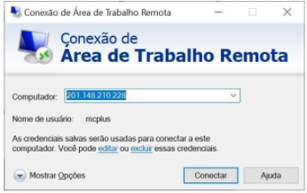
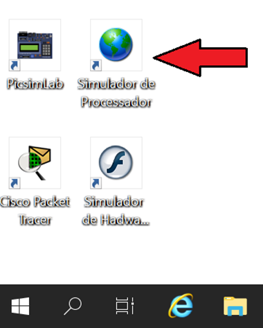
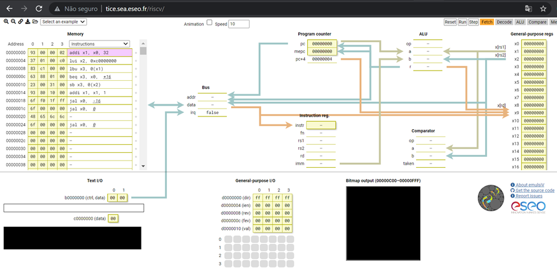
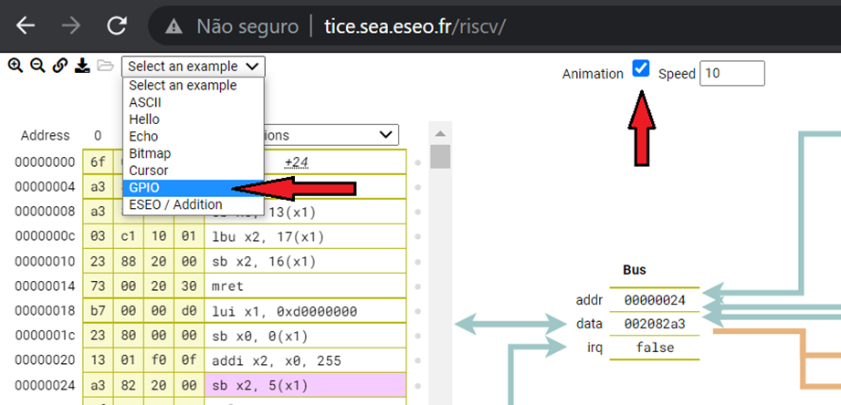
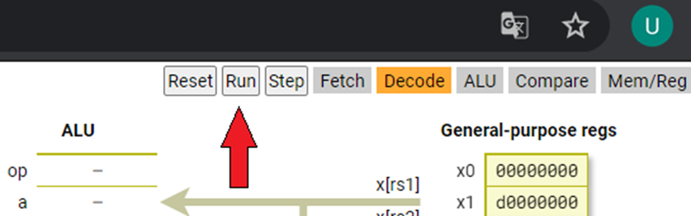

# Comunicação entre Componentes
- 5 Vídeos
- 1 Texto
- 6 Questões
- 1 Atividade Prática

## Ciclo de Instrução - Definição da Arquitetura 📝
**Objetivos:** Reforçar o entendimento do ciclo de instrução e ser capaz de identificar a ocorrência ou não de pipeline, tipo do processador (RISC ou CISC) e se é monociclo, escalar ou superescalar. 
**Materiais, Métodos e Ferramentas:** Para realizar essa prática o aluno precisará somente de um computador ou outro dispositivo com acesso à internet.

**Leia atentamente o texto a seguir.**

Como sabemos, não somente o computador como um todo possui todo um esquema arquitetural, como também cada um dos seus componentes possui sua própria arquitetura. Dessa forma, é muito importante que essas arquiteturas sejam compatíveis, isso melhora significativamente o desempenho do computador. 
Alguns computadores por exemplo suportam processadores/CPUs capazes de executar instruções em paralelo, seja em nível de hardware ou em nível de instrução. Alguns processadores possuem tamanho da palavra maior, outros menor. Uns trabalham com instruções simples, outros com instruções complexas. 
Tudo isso interfere no desempenho do computador em geral, e por esse motivo é importante conhecer essas características. O propósito desta atividade é ajudar-lhe a compreender melhor os processos internos da CPU. 
Para realizar essa atividade você utilizará um recurso online, dessa forma você poderá utilizar seu computador pessoal, um smartphone, o computador virtual da Descomplica ou qualquer outro dispositivo com acesso à internet. Para realizar a atividade, siga as instruções a seguir.

CASO ESTEJA UTILIZANDO UM EQUIPAMENTO PESSOAL

**1º. Passo)** Acesse o endereço web indicado a seguir:

http://tice.sea.eseo.fr/riscv/

CASO DESEJE UTILIZAR A MÁQUINA VIRTUAL DA DESCOMPLICA

**1º. Passo)** Acesse a Área de Trabalho Remota Descomplica, para isso clique em conectar.

**2º. Passo) Abra o link:** Simulador de Processador

Ao abrir o link, imediatamente será apresentada uma tela semelhante a que é apresentada na ilustração abaixo.

**3º. Passo) Realizando a atividade:** Essa é uma atividade muito simples, como outras que já foram propostas, é quase um descanso. Essa atividade nos permite verificar passo a passo, de forma bem didática, todas as etapas da execução de instruções. 
Antes vamos configurar esse ambiente. Observe a imagem a seguir.

Marque a caixa com texto animation. Em seguida escolha a opção GPIO. 
Agora, para poder dar início a atividade, clique no botão Run.

**4º. Passo) Realizando a atividade:** Como dito anteriormente, essa atividade é bem simples. Você verá, ao clicar no botão run, que todas as operações executadas são apresentadas de forma animada. Isso permite verificar passo a passo, de forma muito didática o que está acontecendo. Você não precisa esperar todo o processamento terminar para realizar a atividade. 
Diante disso o que se pede nessa atividade é que você responda:

a) o processador apresentado na aplicação é escalar ou superescalar? 
b) o processador apresentado na aplicação é RISC ou CISC? 
c) o processo está sendo executado em pipeline? 
Todas as respostas devem ser justificadas.