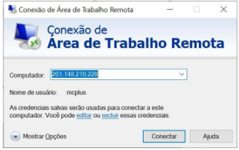
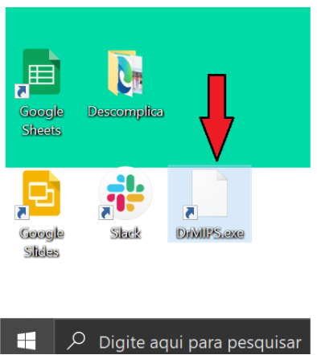
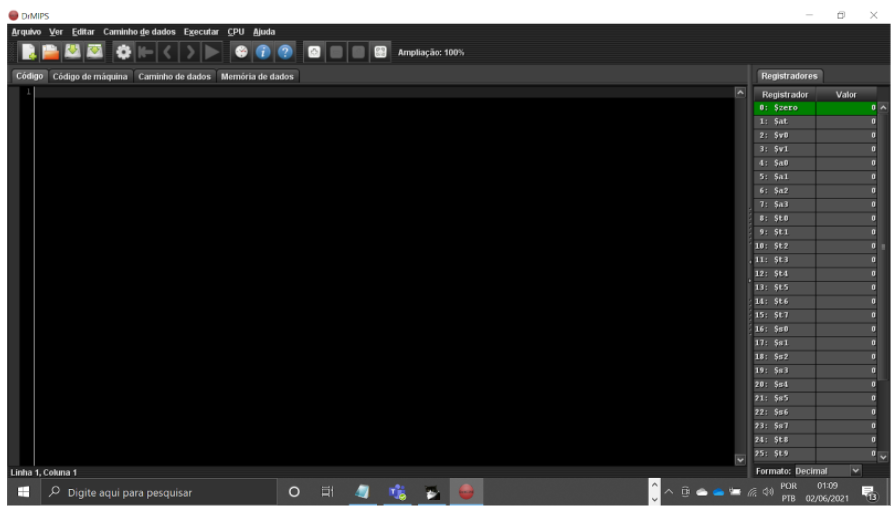
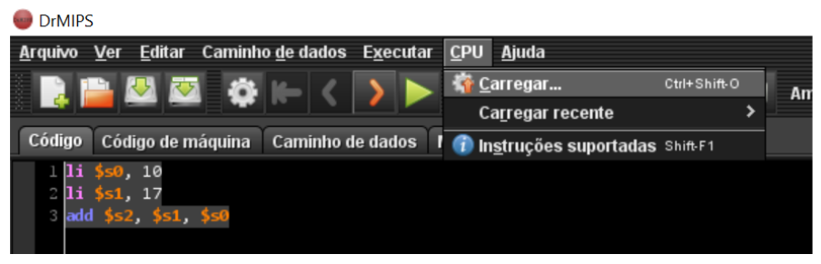
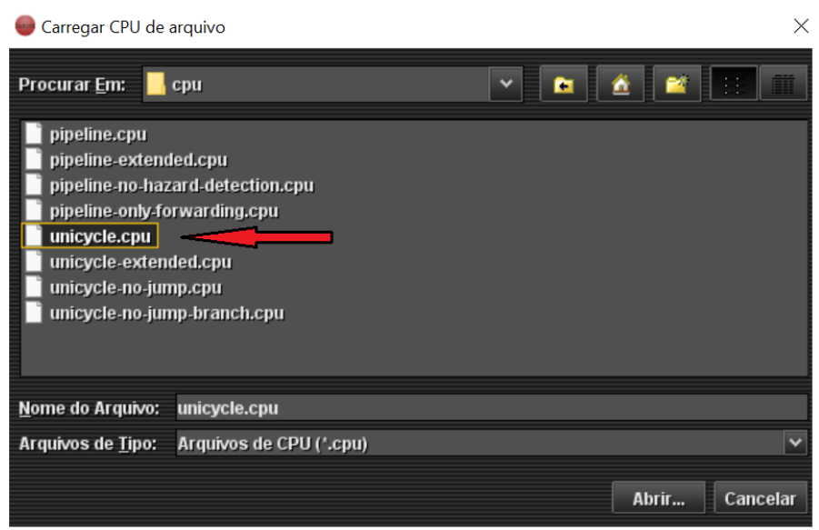
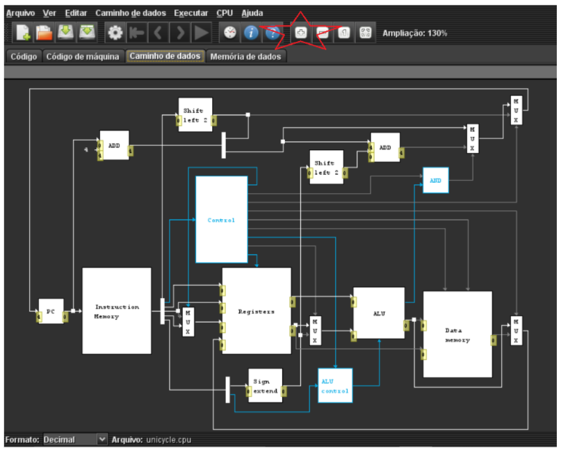
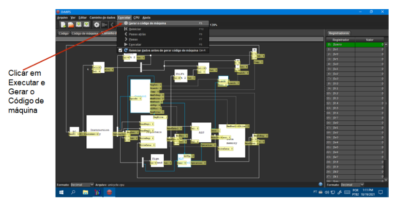
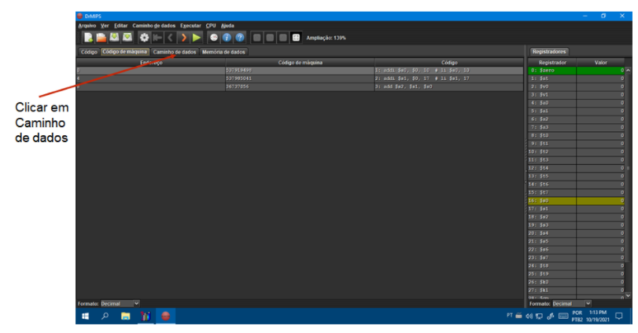
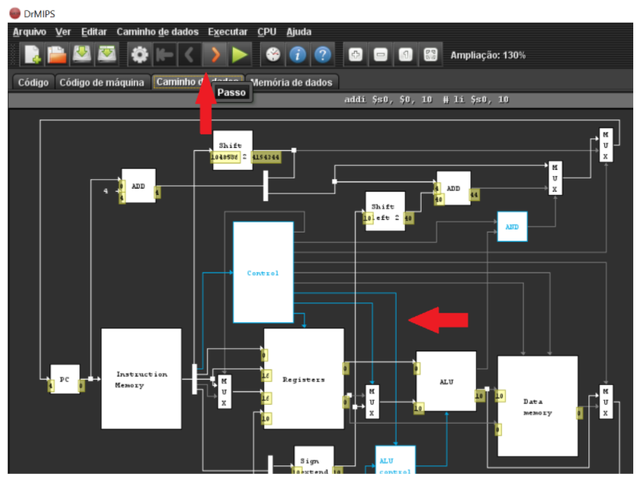
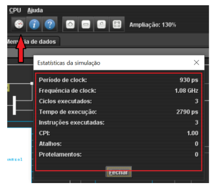

# Entendendo a Unidade Central de Processamento de um Computador
- 5 Vídeos
- 1 Texto
- 6 Questões
- 1 Atividade Prática

## Ciclo de Instruções - Monociclo e Pipeline 📝
**Objetivos:** Compreender a diferença de uma arquitetura em pipeline e monociclo 
**Materiais, Métodos e Ferramentas:** Para realizar essa prática o aluno precisará somente de um computador com acesso à internet e acesso a ferramenta **DrMIPS**

**Leia atentamente o texto a seguir.**

No princípio, os computadores eram capazes de executar somente uma única instrução por ciclo, aliás, os computadores eram ainda mais restritos; além de executar somente uma única instrução por ciclo, concentravam-se em apenas um programa até que todo o programa fosse executado. 
Com o passar dos anos novas arquiteturas foram surgindo, e novas possibilidades também. Modelos de processadores multiciclos foram criados, e também surgiram as arquiteturas em pipeline. 
Assim os processadores não ficavam mais dedicados a um único programa, era possível executar parte da instrução de um programa e intercalar com a execução de parte das instruções de outro programa. Este modelo de processamento ficou conhecido como pipeline. 
Nesta atividade o propósito é que você compreenda a diferença entre as arquiteturas de arquiteturas monociclo e pipeline, e para auxiliar neste processo, iremos utilizar a ferramenta DrMIPS. A ferramenta está no computador remoto da Descomplica que disponibiliza o acesso através da Conexão Remota. Para realizar a atividade, veja as instruções a seguir.

**1º. Passo) Acesse em seu computador (local) a Conexão de Área de Trabalho Remota com o endereço IP do computador remoto da Descomplica e clique em conectar.** 
**Observação:** o endereço IP do computador remoto pode passar por atualização. Certifique-se com o professor tutor.

**2º. Passo) Abra a ferramenta:** DrMIPS do computador remoto da Descomplica.

Ao abrir o aplicativo, imediatamente é apresentada a tela a seguir.

**3º. Passo) Resolvendo o desafio:** Na aba código, insira o seguinte: 
li $s0, 10 
li $s1, 17 
add $s2, $s1, $s0

Feito isso, clique em CPU e carregue a CPU **unicycle.cpu.**
As imagens a seguir irão ajudar a entender melhor o procedimento.

Feito isso, na aba **caminho de dados** deverá aparecer algo semelhante ao que é apresentado na imagem a seguir.

Essa imagem representa o circuito de um processador monociclo. Caso seja necessário, você pode aumentar ou diminuir o zoom. A estrela marca o botão com a opção de aumentar.

**4º. Passo) Realizando a atividade:** Agora que o código foi carregado e também a CPU, podemos realizar a atividade. 
Observe o botão em destaque na imagem a seguir, observe também as linhas em azul.

O botão permite executar uma o ciclo passo a passo. As linhas azuis mostram quais componentes da cpu estão sendo acessados.

Seu **primeiro desafio** aqui é descrever passo a passo toda a sequência de execução do código que foi criado. 
Seu **segundo desafio** será verificar os dados finais da execução, apresentá-los e comentar. A imagem a seguir mostra como esses dados podem ser obtidos. 
Basicamente, basta clicar no botão com formato de relógio que fica na barra de menu superior.

Você deverá repetir essas operações para a cpu pipeline.cpu.