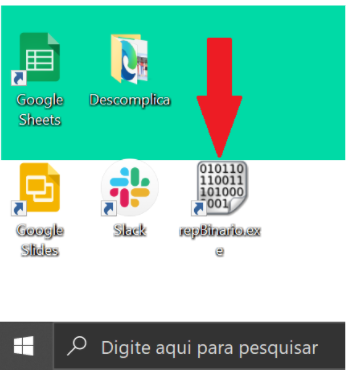
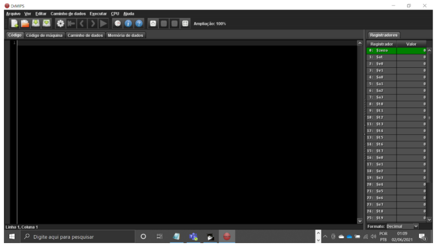
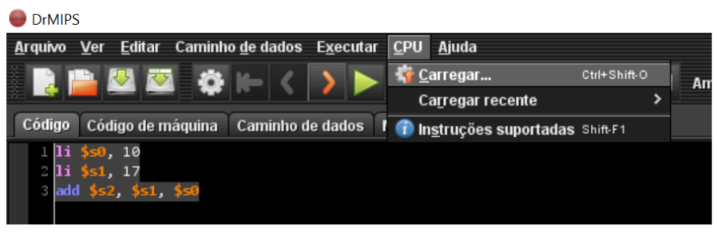
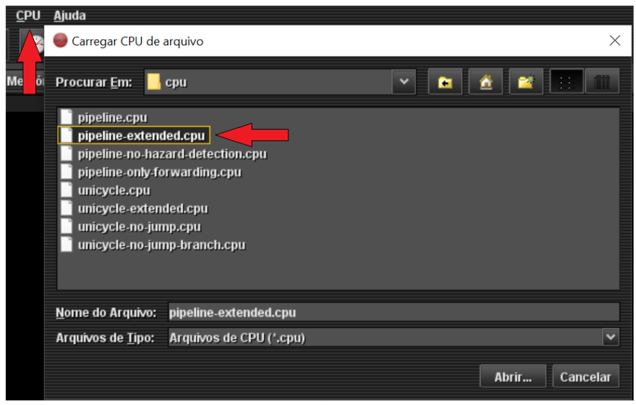
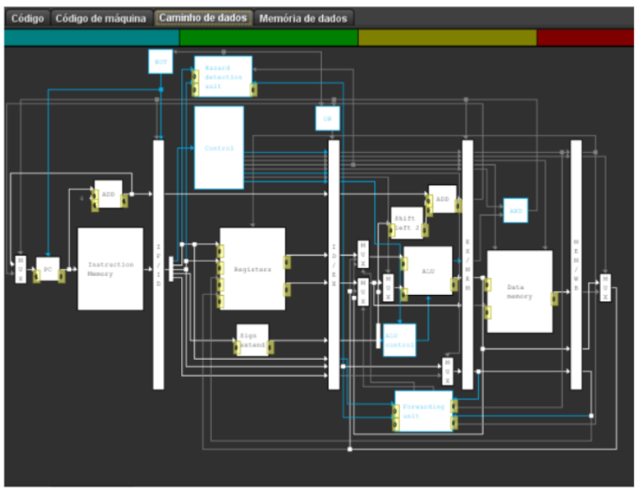
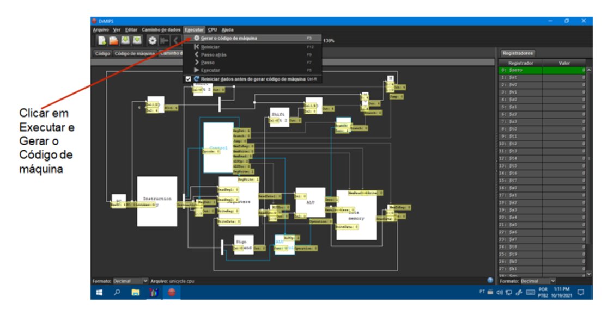
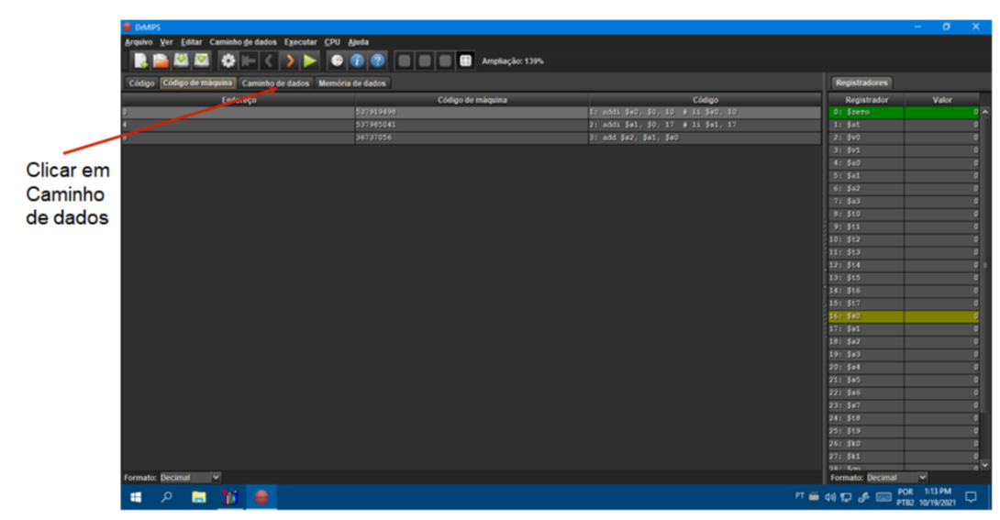
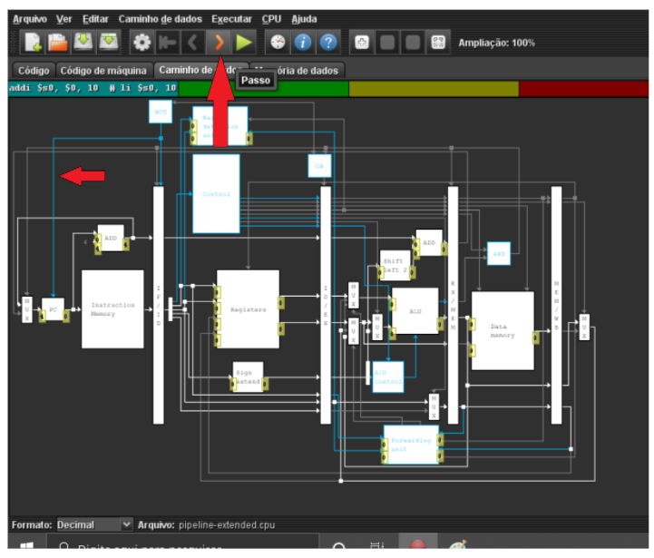

# Principais Tipos de Arquiteturas de CPU's
- 5 Vídeos
- 1 Texto
- 6 Questões
- 1 Atividade Prática

## Arquitetura dos Microprocessadores 📝
**Objetivos:** Entender a arquitetura dos microprocessadores, a semântica de execução das instruções, bem como o papel de cada componente. 
**Materiais, Métodos e Ferramentas:** 
Para realizar essa prática o aluno precisará somente de um computador com acesso à internet e acesso a ferramenta **DrMIPS**

**Leia atentamente o texto a seguir.**

Compreender a estrutura interna de um microprocessador é um dos fundamentos para compreensão de como um computador realmente funciona. Não é incomum supor que entendamos de computadores, mas sem sequer conhecer uma parcela de toda sua complexidade. 
O entendimento dos detalhes dos computadores podem ser fundamentais para a escolha dos componentes mais adequados para as características de uma placa mãe, ou de outros componentes associados. Este entendimento também é fundamental para a escolha do sistema operacional que será executado no computador. 
O propósito dessa atividade é justamente reforçar seu conhecimento quanto à estrutura interna e funcionamento dos processadores. Para realizar essa atividade você utilizará a aplicação **DrMIPS**. Esta aplicação está instalada no computador remoto (virtual) da Descomplica. Para realizar a atividade, veja as instruções a seguir.

**1º. Passo) Acesse em seu computador (local) a Conexão de Área de Trabalho Remota com o endereço IP do computador remoto da Descomplica e clique em conectar.** 
**Observação:** o endereço IP do computador remoto pode passar por atualização. Certifique-se com o professor tutor.

**2º. Passo) Abra o atalho da ferramenta** DrMIPS do computador remoto da Descomplica.

Ao abrir o aplicativo, imediatamente é apresentada a tela a seguir.

**3º. Passo) Resolvendo o desafio:** Na aba código, insira o seguinte: 
li $s0, 10 
li $s1, 17 
add $s2, $s1, $s0

Feito isso, clique em CPU e carregue a CPU **pipeline-extended.cpu.**

As imagens a seguir irão ajudar a entender melhor o procedimento.

Feito isso, na aba **caminho de dados** deverá aparecer algo semelhante ao que é apresentado na imagem a seguir.

Essa imagem representa o circuito de um processador pipeline estendido. Caso seja necessário, você pode aumentar ou diminuir o zoom. A estrela marca o botão com a opção de aumentar.

**4º. Passo) Realizando a atividade.** Agora que o código foi carregado e também a CPU, podemos realizar a atividade. 
Observe o botão em destaque na imagem a seguir, observe também as linhas em azul.

O botão permite executar uma o ciclo passo a passo. As linhas azuis mostram quais componentes da cpu estão sendo acessados.

Seu **primeiro desafio** aqui é identificar se a estrutura de CPU apresentada é ou não **superescalar** - isso pode ser identificado observando o fluxo de execução - e **justificar** sua resposta.