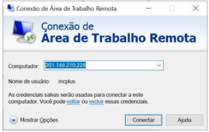
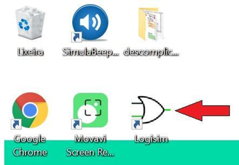
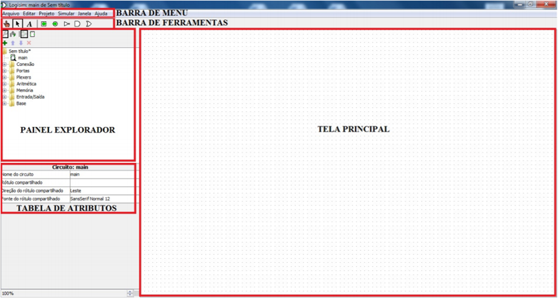
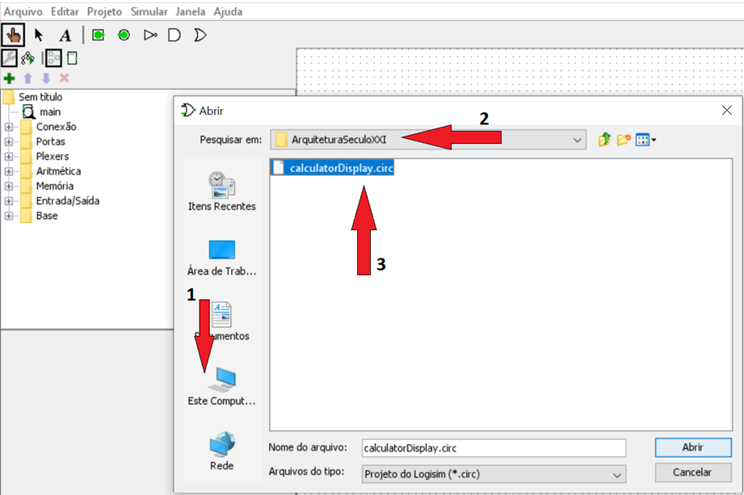
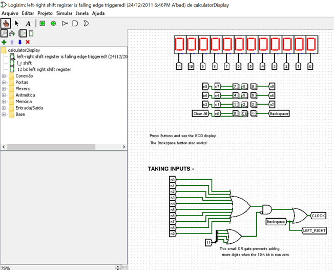
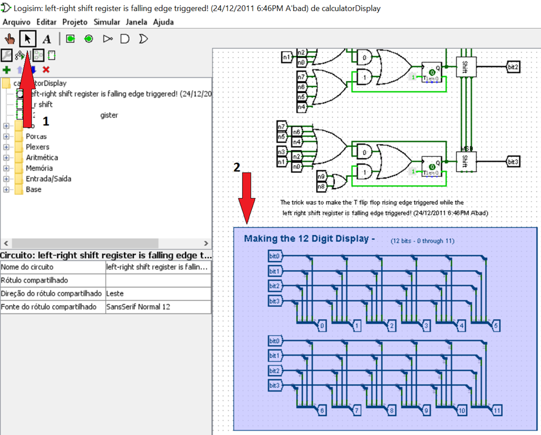
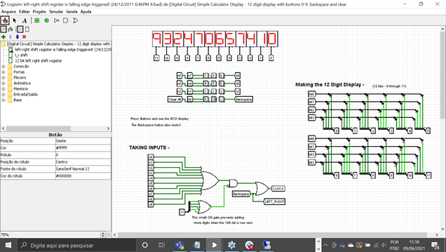
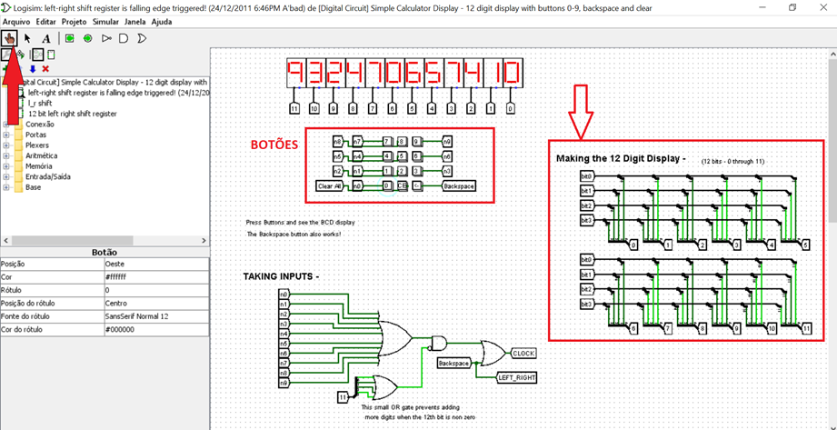

# Execução de Instruções em CPUs
- 5 Vídeos
- 1 Texto
- 6 Questões
- 1 Atividade Prática

## Título da Prática: Entrada e Saída de Dados em Circuitos Digitais 📝
**Objetivos:** Trazer luz sobre o processo de conversão dos dados enviados à CPU através de sinais elétricos, e sua conversão em valores naturais - numéricos - fornecendo assim maior compreensão de como os dados são processados pela CPU. 
**Materiais, Métodos e Ferramentas:** 
Para realizar essa prática o aluno precisará somente de um computador com acesso à internet e da ferramenta LogiSim

**Leia atentamente o texto a seguir.**

Constantemente temos falado sobre a importância de se entender o funcionamento interno de um computador, mais do que isso, temos frisado muito o quão é importante compreender como os processadores funcionam, e como esse entendimento pode ajudar no desenvolvimento de aplicações mais eficientes. 
Constantemente temos falado sobre a importância de se entender o funcionamento interno de um computador, mais do que isso, temos frisado muito o quão é importante compreender como os processadores funcionam, e como esse entendimento pode ajudar no desenvolvimento de aplicações mais eficientes. 
O propósito dessa atividade é permitir que você possa compreender como os dados são processados em uma CPU, e como os pulsos elétricos são convertidos em valores naturais, tais como números. Para realizar essa atividade você utilizará a aplicação LogiSim. Esta aplicação está instalada no computador virtual da Descomplica. Para realizar a atividade, siga as instruções a seguir.

1º. Passo) Acesse a Área de Trabalho Remota Descomplica, para isso clique em conectar.

2º. Passo) Abra a ferramenta: LogiSim

Ao abrir o aplicativo, imediatamente será apresentada semelhante a que é apresentada na ilustração abaixo. Essa é sua área de trabalho, a partir dela, todos os recursos da ferramenta estarão disponíveis.

3º. Passo) Preparando o ambiente: Agora que o LogiSim está em execução, vamos abrir um projeto que já está pronto e armazenado no computador. Para acessar o projeto, siga os seguintes passos.
Clique em Arquivo (1) no menu superior, em seguida clique em Abrir… (2).

Feito isso, devemos escolher o projeto que será aberto. Basta para isso, escolher o projeto. Para isso, clique no ícone Este Computador (1), depois navegue pelas pastas até encontrar o Disco Local © e dentro dele a pasta ArquiteturaSeculoXXI (2), dentro desta pasta, selecione o arquivo calculatorDisplay.circ (3)

Feito isso, um projeto como o apresentado na figura a seguir deve aparecer na tela.

Rolando a tela do projeto para baixo, você vai encontrar o seguinte modelo de circuito:

Clique na seta preta (1), selecione todo o circuito (2), e arraste-o para cima, vamos deixar semelhante ao que veremos na tela a seguir.

4º. Passo) Realizando a atividade. Agora que o circuito está carregado no LogiSim e o ambiente está devidamente ajustado, vamos entender o que deve ser feito na atividade. 
Esta é uma atividade muito simples, escolhida especialmente para dar um certo descanso para vocês. 
Para podermos testar o display apresentado no circuito, devemos clicar nesse botão que se parece com uma mão. Depois basta clicar em algum dos botões que estão no destaque.

Ao clicar nos botões, inicie pelos números, vocês irão perceber que o circuito apontado pela seta sem preenchimento irá interagir. É esse circuito que vocês terão que analisar. 
A única dica que posso dar para vocês é: lembrem da base binária.