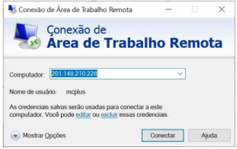
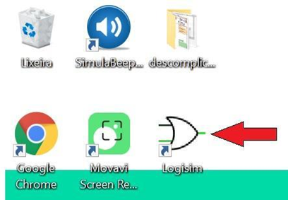
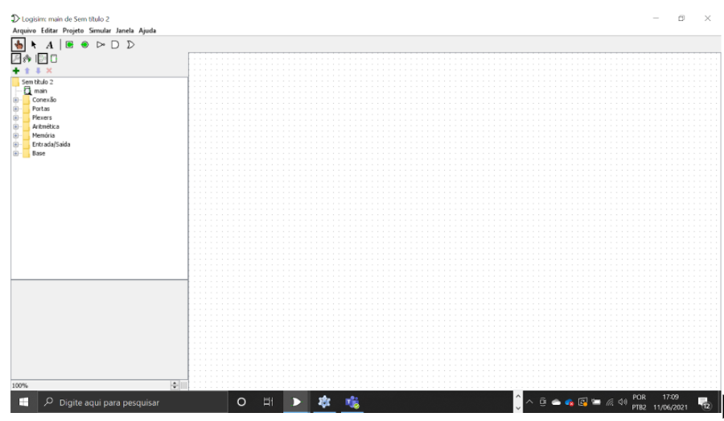
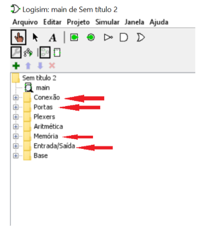
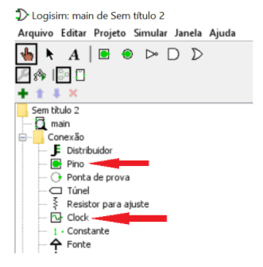
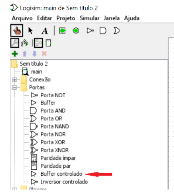
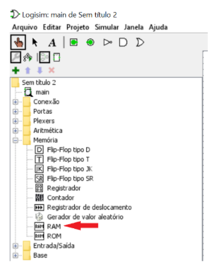
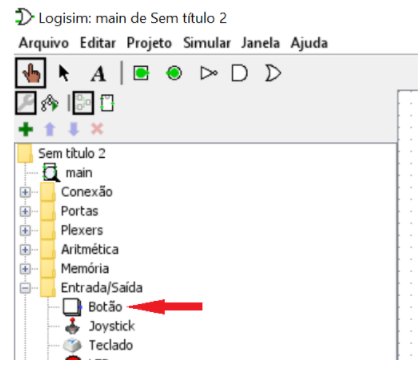

# Principais Tipos de Memória de um Computador
- 5 Vídeos
- 1 Texto
- 6 Questões
- 1 Atividade Prática

## Principais Criando um circuito parcial de uma memória RAM 📝
**Objetivos:** compreender como funcionam o armazenamento e transferência de dados em memórias do tipo DRAM. 
**Materiais, Métodos e Ferramentas:** 
Para realizar essa prática o aluno precisará somente de um computador com acesso a internet e da ferramenta LogiSim

**Leia atentamente o texto a seguir.**

Todo procedimento interno da CPU e de qualquer computador é baseado em sinais elétricos. Entender como esses procedimentos ocorrem é fundamental para os profissionais da computação. 
Quando estamos nos referindo às memórias de um computador, essa afirmação continua sendo verdade, ou seja, as memórias também têm seu funcionamento baseado em impulsos elétricos. 
As memórias podem apresentar diferenças, em relação a outros dispositivos, na implementação de seus componentes. Algumas memórias podem ser totalmente desenvolvidas com dispositivos eletrônicos, enquanto outras podem ser desenvolvidas com dispositivos eletromagnéticos. 
Nessa atividade, você terá a oportunidade de observar a forma como a memória principal atua. Para isso, iremos construir parcialmente um circuito que envolve a implementação de uma RAM. 
Para realizar essa atividade você utilizará a aplicação **LogiSim**. Esta aplicação está instalada no computador remoto (virtual) da Descomplica. 
Para realizar a atividade, veja as instruções a seguir.

**1º. Passo) Acesse em seu computador (local) a Conexão de Área de Trabalho Remota com o endereço IP do computador remoto da Descomplica e clique em conectar.**

**Observação:** o endereço IP do computador remoto pode passar por atualização. Certifique-se com o professor tutor.

**2º. Passo) Abra o atalho da ferramenta LogiSim** do computador remoto da Descomplica.

Ao abrir o aplicativo, imediatamente é apresentada a tela a seguir.

Nessa tela, o que merece sua atenção são os seguintes campos: **conexão, portas, memória e entrada/saída.**

Em cada um desses itens, vamos utilizar os seguintes componentes:

a) **Em conexões:** Os componentes que queremos são **pino** e **clock**

b) **Em portas:** Queremos somente o componente **Buffer controlado**

c) **Em Memória:** Queremos somente o componente **RAM**

d) **Em Entrada/saída:** Queremos somente o componente **Botão**

**3º. Passo) Resolvendo o problema:** Nessa atividade você terá que criar um circuito que simula parcialmente uma célula de memória. É altamente recomendado que você assista a aula 8 antes de tentar realizar a atividade. A célula de memória que você irá criar deverá ter 8 bits.