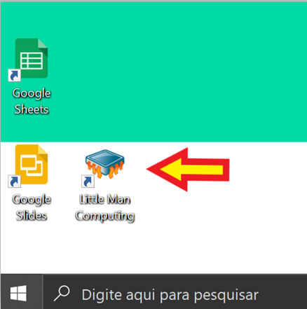
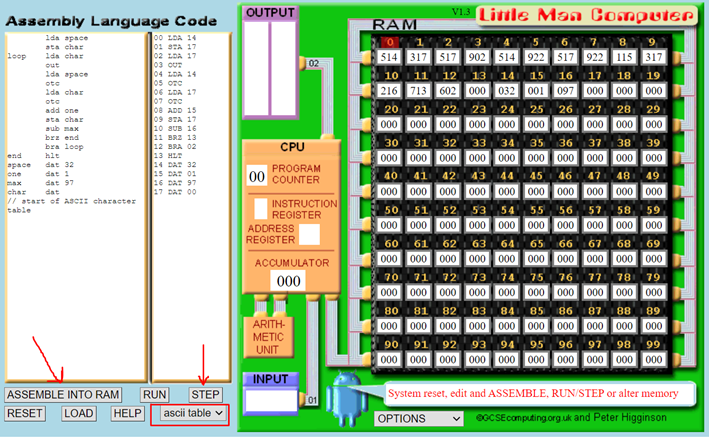

# Ciclo de Máquina
- 5 Vídeos
- 1 Texto
- 6 Questões
- 1 Atividade Prática

## Principais Representando os Procedimentos em um Ciclo de CPU 📝
**Objetivos:** Principais Representando os Procedimentos em um Ciclo de CPU 
**Materiais, Métodos e Ferramentas:** Para realizar essa prática o aluno precisará somente de um computador com acesso a internet e a ferramenta online Litte Man computer - https://peterhigginson.co.uk/lmc/

**Leia atentamente o texto a seguir.**

Até aqui muito conhecimento já foi adquirido. Sabemos por exemplo, que é papel da Unidade de Controle gerenciar tudo o que ocorre dentro da CPU, ou seja, é responsabilidade da CPU definir o que será feito e quando, até mesmo quando uma instrução determina o que deve ser feito, é papel da CPU garantir que àquela instrução seja corretamente executada 
Um dos componentes da CPU que faz parte do conjunto de componentes que tem como propósito o gerenciamento das ações do computador, é o Contador de Programa. Este é o componente responsável por armazenar o endereço de memória da próxima instrução a ser executada 
Pode-se dizer que todos os procedimentos realizados pela CPU durante a execução dos programas tem início no Contador de Programa, pois é exatamente ele que armazena o endereço de memória da instrução que deverá ser recuperada para então ser executada 
Esta atividade consiste basicamente em compreender como este procedimento ocorre, entender a função do Contador de Programa e como este componente opera para a execução dos programas de computador. Para realizar essa atividade você precisará de um computador com acesso a internet, podendo ou não usar o computador remoto da Descomplica e acesso ao Litte Man computer - https://peterhigginson.co.uk/lmc/. 
Caso opte por não utilizar a Área de Trabalho Remota Descomplica, basta abrir seu navegador de internet e visitar o seguinte endereço eletrônico: https://peterhigginson.co.uk/lmc/. 
Caso opte por usar a Área de Trabalho Remota Descomplica, siga os passos a seguir:

**1º. Passo) Acesse a Área de Trabalho Remota Descomplica, para isso clique em conectar** 
**Observação:** o endereço IP do computador remoto pode passar por atualização. Certifique-se com o professor tutor

**2º. Passo) Abra a ferramenta:** Little Man Computing

Ao abrir o aplicativo, imediatamente será apresentada uma tela semelhante a que é apresentada na ilustração abaixo

**3º. Passo) Resolvendo a atividade:** Na tela que foi apresentada, primeiramente selecione a opção ascii table, como é demonstrado pelo retângulo de borda vermelha. Em segundo lugar, clique no botão ASSEMBLE INTO RAM, isso carregará o programa para a memória. Depois siga realizando cliques no botão STEP, a cada clique, um novo passo será executado

Observe atentamente cada passo do processo e descreva-o com o máximo de detalhes que puder.
Sucesso!