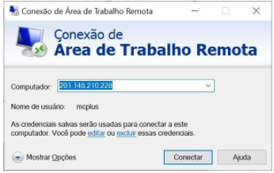
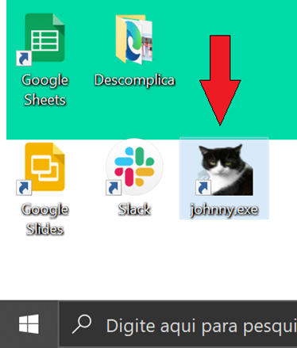
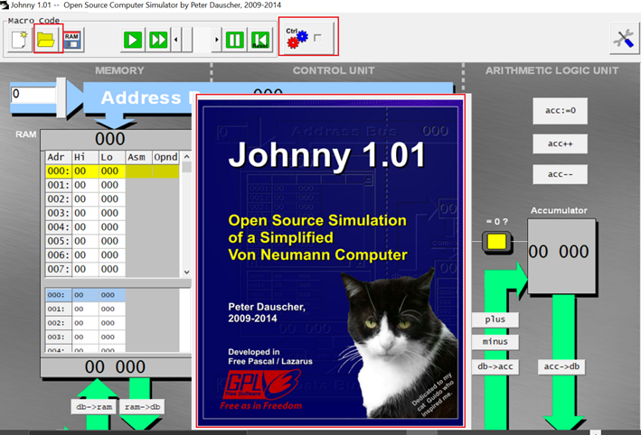
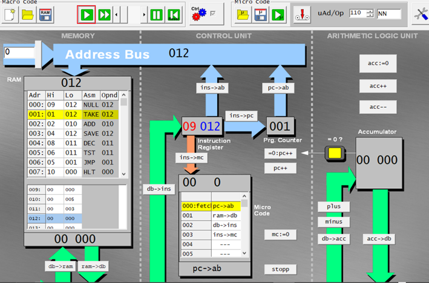
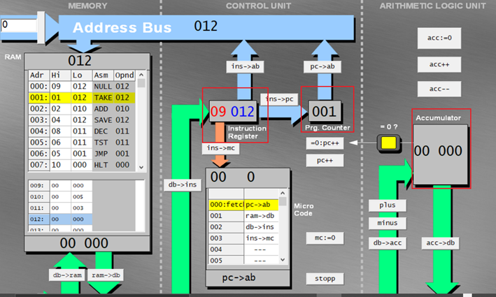

# Operações do Módulo de Entrada e Saída de Dados
- 5 Vídeos
- 1 Texto
- 6 Questões
- 1 Atividade Prática

## Ciclos de Instrução 📝
**Objetivos:** Compreender como ocorre o processo de execução de uma instrução pela Unidade Central de Processamento 
**Materiais, Métodos e Ferramentas:** Para realizar essa prática o aluno precisará somente de um computador com acesso à internet e acesso a ferramenta johnny

**Leia atentamente o texto a seguir.**

Apesar de, como usuários, imaginarmos que a execução de um programa no computador é algo simples, e que o computador simplesmente faz algo que está sendo definido por um conjunto de instruções, a verdade é bem diferente. 
Sempre que solicitamos a abertura de um programa ou realizamos qualquer outra operação em nosso computador, ou mesmo que nada façamos, além de ligar o computador, diversas sequências de atividades são disparadas, e a CPU deve se encarregar de realizar todas elas, e da forma mais rápida possível. Entretanto, para executar uma única instrução, a CPU deve realizar um ciclo com pelo menos três tarefas. 
Ao conjunto de tarefas que a CPU precisa realizar para executar uma instrução, dá-se o nome de ciclo de cpu, ciclo de instrução ou clock. E o propósito dessa atividade é justamente ajudá-lo a entender um pouco melhor tudo o que ocorre na execução de cada instrução de um programa. 
Para realizar essa atividade você utilizará uma ferramenta chamada johnny. A ferramenta está no computador cuja Descomplica disponibiliza o acesso através da Conexão Remota. Para realizar a atividade, siga as instruções a seguir

**1º. Passo) Acesse a Área de Trabalho Remota Descomplica, para isso clique em conectar**

**2º. Passo) Abra a ferramenta:** johnny.exe

Sim, é um gatinho…

Ao abrir o aplicativo, imediatamente será apresentada uma tela semelhante a que é apresentada na ilustração abaixo

**3º. Passo) Resolvendo o desafio:** primeiro, clique no gato, depois clique na caixinha que está logo à direita das engrenagens. Por fim, clique na pastinha aberta e encontre o arquivo **multiplikation.ram**, ele estará na mesma pasta em que se encontra o programa

Agora uma tela semelhante a que é apresentada abaixo deve aparecer

**4º. Passo) Realizando a atividade:** Uma vez que o código que será analisado foi carregado, clique na seta semelhante a um botão **play**. A cada clique uma instrução é executada e os valores na tela vão sendo alterados

O que nos interessa nesse momento é saber quais serão os valores para os seguintes componentes (Instruction Register, Prg. Counter e Accumulator), a cada instrução executada