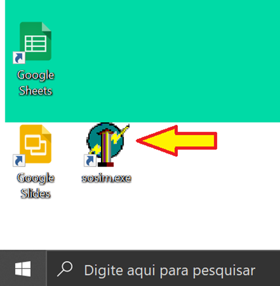
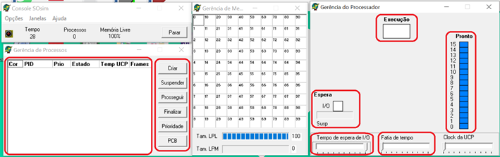
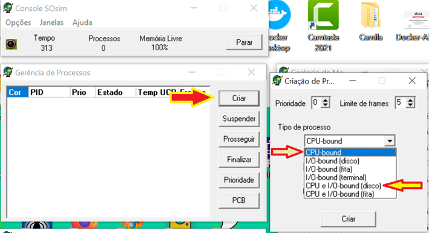
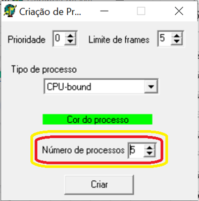
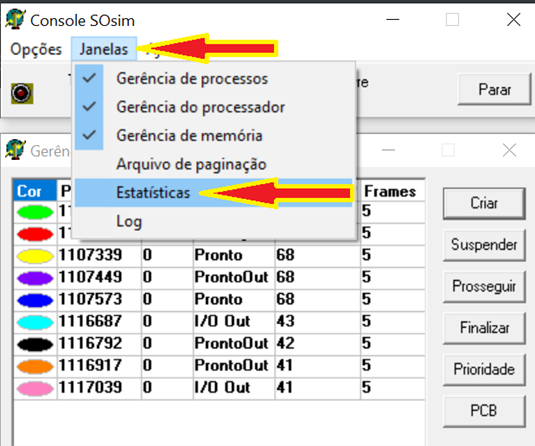
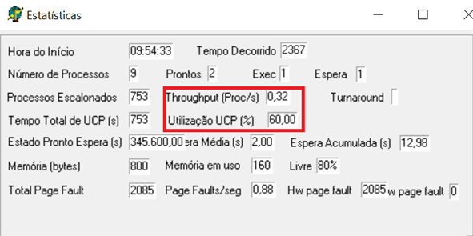
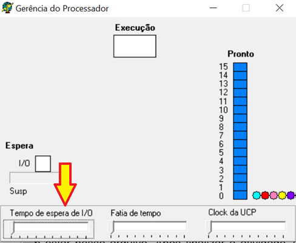

# Recurso de Interrupção de Ciclo de CPU
- 5 Vídeos
- 1 Texto
- 6 Questões
- 1 Atividade Prática

## Tipos de Interrupção 📝
**Objetivos:** Permitir que o aluno compreenda com maior facilidade como as interrupções podem melhorar o desempenho dos sistemas computacionais 
**Materiais, Métodos e Ferramentas:** Para realizar essa prática o aluno precisará somente de um computador com acesso a internet, ao ambiente remoto da Descomplica e da ferramenta SOSIM.exe

**Leia atentamente o texto a seguir.**

Um importante recurso que permite aumentar consideravelmente o desempenho de sistemas computacionais, são os recursos de interrupção de ciclo de CPU. Com este tipo de recurso, a CPU não fica ociosa durante todo o tempo em que um dispositivo de entrada e saída é requisitado, aguardando que todo processamento termine, ao invés disso, a CPU realiza outras atividades, e quando o módulo de entrada e saída necessita, ele envia um aviso de interrupção a CPU 
Este recurso pode funcionar independentemente da existência ou não de um módulo de acesso direto à memória no computador, entretanto, quando estes módulos estão presentes, o módulo de entrada e saída pode realizar mais atividades sem a necessidade de interromper ciclos de CPU 
Para realizar essa atividade você utilizará a aplicação SOSIM.exe. Esta aplicação está instalada no computador virtual da Descomplica. Para realizar a atividade, siga as instruções a seguir

**1º. Passo) Acesse a Área de Trabalho Remota Descomplica, para isso clique em conectar.** 
**Observação:** o endereço IP do computador remoto pode passar por atualização. Certifique-se com o professor tutor

**2º. Passo) Abra a ferramenta:** SOSIM.exe

Ao abrir o aplicativo, imediatamente será apresentada uma tela semelhante a que é apresentada na ilustração abaixo

A primeira consideração que deve ser feita, é que esse aplicativo apresenta as telas de forma suspensa, ou seja, cada uma delas se apresenta de forma separada e independente

Os demais campos que merecem destaque, estão marcados em vermelho, e serão explicados no próximo passo

**3º. Passo) Resolvendo a atividade:** O primeiro passo, é preparar a ferramenta para que ela realize as atividades da forma como esperado. Sendo assim, clique no botão criar, selecione o tipo CPU-bound, crie 5 processos deste tipo. Em seguida repita a operação, agora selecionando o tipo CPU e I/O-bound (disco), nesse caso crie 4 processos. As imagens abaixo podem auxiliar nesse processo

Feito isso, deixe executando por algum tempo, e depois siga a seguinte instrução: clique em **Janelas -> Estatísticas**
Os dados que iremos analisar estão marcados em vermelho. Observe as figuras a seguir

Agora, vamos fazer uma pequena alteração nas configurações. Feche a aplicação, repita os passos anteriores, mas desta vez, vamos configurar o **tempo de espera de I/O** para o mínimo possível. Assim como demonstrado na imagem a seguir. Faça isso e deixe a aplicação executando por mais algum tempo

Depois, repita a operação de **Janelas -> Estatísticas** e analise os resultados