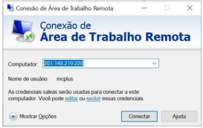
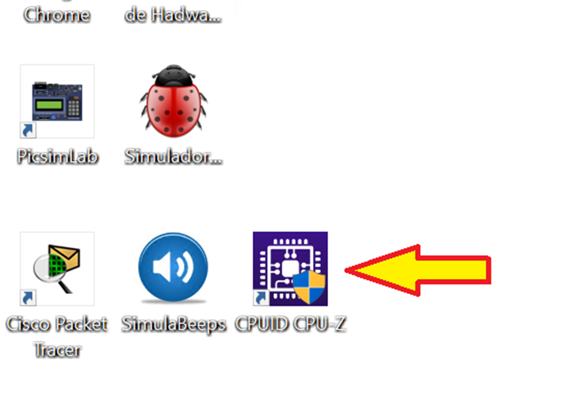
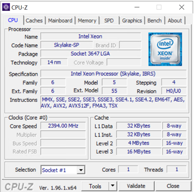

# Medição de Desempenho de Hardware
- 5 Vídeos
- 1 Texto
- 6 Questões
- 1 Atividade Prática

## Verificando o Desempenho do Computador 📝
**Objetivos:** Permitir que o aluno pratique seus conhecimentos relacionados à importância de cada um dos componentes estudados e sua influência no desempenho do sistema 
**Materiais, Métodos e Ferramentas:** Para realizar essa prática o aluno precisará somente de um computador com acesso a internet, ao ambiente remoto da Descomplica e da ferramenta CPUID CPU-Z

**Leia atentamente o texto a seguir.**

Diversos fatores podem influenciar, ou interferir no desempenho do computador, e isso inclui a presença ou não de determinados componentes físicos e até mesmo as características desses componentes 
A capacidade de processamento da CPU, o que envolve sua frequência de clock o número de núcleos que a CPU possui e até mesmo a qualidade de seus componentes internos, a presença ou não das memórias cache, a qualidade dos barramentos, o tamanho e também a frequência das memórias, a tecnologia utilizada nas memórias secundárias, e até mesmo a presença de outros recursos de hardware e os próprios softwares, podem influenciar de forma significativa no desempenho do computador 
Para realizar essa atividade você utilizará a aplicação CPUID CPU-Z. Esta aplicação está instalada no computador virtual da Descomplica. Para realizar a atividade, siga as instruções a seguir

**1º. Passo) Acesse a Área de Trabalho Remota Descomplica, para isso clique em conectar.** 
**Observação:** o endereço IP do computador remoto pode passar por atualização. Certifique-se com o professor tutor

**2º. Passo) Abra a ferramenta: CPUID CPU-Z**

Ao abrir o aplicativo, imediatamente será apresentada uma tela semelhante a que é apresentada na ilustração abaixo.

**3º. Passo) Resolvendo a atividade:** Observe que a tela apresenta diversas informações sobre o computador. Nem todas serão solicitadas na resposta da atividade, por isso é recomendado seguir os parâmetros da folha de resposta