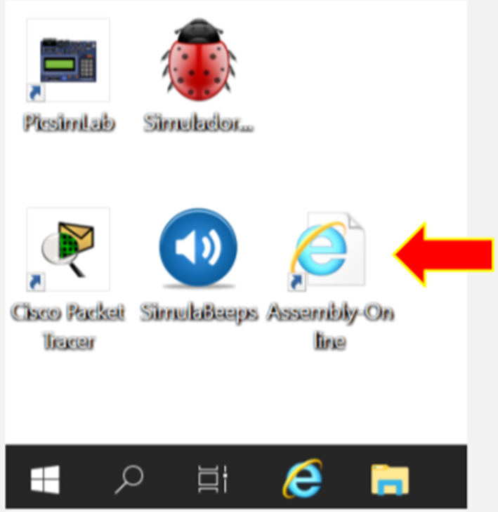
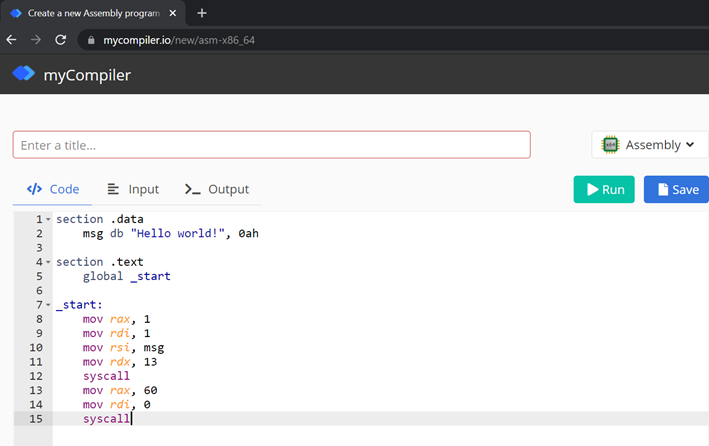
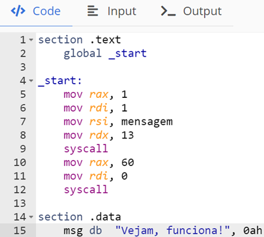

# Pipeline do Processo de Criação de Software
- 5 Vídeos
- 1 Texto
- 6 Questões
- 1 Atividade Prática

## Entendendo o processo de compilação 📝
**Objetivos:** Permitir que o aluno melhore sua compreensão sobre o procedimento de compilação de códigos fonte 
**Materiais, Métodos e Ferramentas:** Para realizar essa prática o aluno precisará somente de um computador com acesso a internet, ao ambiente remoto da Descomplica e ao ambiente web MyCompiler

**Leia atentamente o texto a seguir.**

Sabemos que um sistema computacional somente estará completo se além da presença de todos os recursos de hardware necessários para seu funcionamento, estiverem também presentes os recursos de software capazes de controlar e permitir a interação com o computador 
Quando um software é desenvolvido, em seu pipeline, ou seja, processo de produção, existe uma atividade conhecida como compilação. Durante essa atividade, a aplicação responsável por compilar o software irá realizar algumas verificações no código escrito, a partir dessa análise a aplicação poderá encontrar, se houver, alguns erros de sintaxe ou de semântica 
Algumas aplicações indicam inclusive o local exato do erro, sendo que algumas sugerem até mesmo soluções. Seu papel nessa atividade é relativamente simples. Você será o “compilador”, isso significa que deverá analisar um código, indicar a existência ou não de erros, e sugerir a solução 
Para realizar essa atividade você utilizará o ambiente web chamado MyCompiler, o qual poderá ser acessado diretamente pela Área de Trabalho Remota da Descomplica, ou de qualquer outro computador, tablet ou smartphone, ou outro dispositivo com acesso a internet e navegador web

**1º. Passo) Aqui veremos como acessar o MyCompiler:** Caso opte por acessar diretamente de algum dispositivo pessoal, siga a instrução abaixo, caso contrário, siga para o 2º passo

Acesse o seguinte endereço web: https://www.mycompiler.io/new/asm-x86_64.

**2º. Passo) Acesse a Área de Trabalho Remota Descomplica, para isso clique em conectar.** 
**Observação:** o endereço IP do computador remoto pode passar por atualização. Certifique-se com o professor tutor

**3º. Passo) Abra a ferramenta:** Assembly-OnLine

Ao abrir o aplicativo, imediatamente será apresentada uma tela semelhante a que é apresentada na ilustração abaixo

**4º. Passo) Resolvendo a atividade:** Observe o código que é apresentado a seguir:

Depois de copiar o código para o ambiente, clique no botão **Run**. Veja o que será apresentado como resposta. Certamente será um erro, seu papel é corrigir o erro