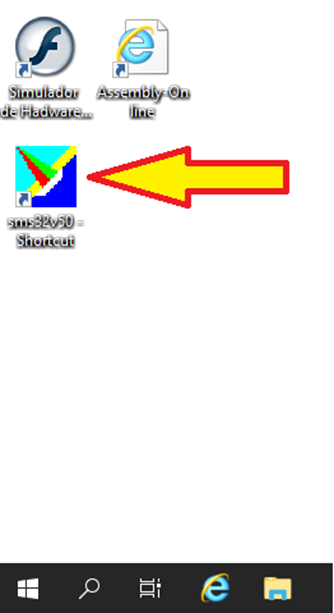
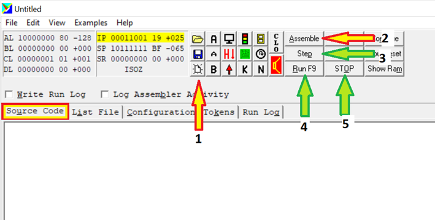

# Gerenciamento do Hardware com a Linguagem Assembly
- 5 Vídeos
- 1 Texto
- 6 Questões
- 1 Atividade Prática

## Programações com a linguagem Assembly 📝
**Objetivos:** Permitir que o aluno tenha melhor compreensão da relação existente entre o software e o hardware, e melhorar seu entendimento sobre o uso dos registradores<br>
**Materiais, Métodos e Ferramentas:** Para realizar essa prática o aluno precisará somente de um computador com acesso a internet, ao ambiente remoto da Descomplica e ao aplicativo Sms32v50

**Leia atentamente o texto a seguir.**

Pode parecer redundante, mas nunca é demais lembrar que qualquer sistema computacional somente estará completo se em sua estrutura estiverem presentes recursos de hardware e software<br>
Sem os hardwares, os softwares sequer existiriam, dessa forma nem é preciso explicar sua importância para o sistema computacional, em contrapartida, em os softwares os hardwares não passam de amontoados de fios, placas e circuitos, todos sem qualquer utilidade para o ser humano.<br>
Independentemente de qualquer coisa, os computadores são capazes de compreender somente instruções binárias, ou seja, conjuntos de zeros e uns, entretanto, para que o ser humano seja capaz de escrever programas para computadores, foram criadas técnicas capazes de converter palavras do idioma natural em instruções mnemônicas, chamadas Assembly, que por sua vez são convertidas em instruções de máquina<br>
Nessa atividade será verificado seu entendimento em relação a linguagem de programação Assembly, também conhecida como linguagem de montagem. Nela iremos simular o controle de semáforos; Para tal, iremos utilizar o aplicativo **Sms32v50**

**1º. Passo) Acesse a Área de Trabalho Remota Descomplica, para isso clique em conectar.**<br>
**Observação:** o endereço IP do computador remoto pode passar por atualização. Certifique-se com o professor tutor

<p align="center"></p>

**2º. Passo) Abra a ferramenta: Sms32v50**

<p align="center"></p>

Ao abrir o aplicativo, imediatamente será apresentada uma tela semelhante a que é apresentada na ilustração abaixo

<p align="center"></p>

Nessa tela, a seta de **número 1** permite iniciar um novo programa, a seta de **número 2** compila o programa, a seta de **número 3** permite executar instrução por instrução, a seta de **número 4** executa o programa sem interrupções, e a seta **número 5** para a execução.

**4º. Passo) Resolvendo a atividade:** No exemplo apresentado em vídeo, temos um código que insere ações em um de dois semáforos. Nesta atividade você deverá inserir ações do segundo semáforo. Entretanto, enquanto o primeiro estiver verde, o segundo deverá estar vermelho.<br>
Utilize o código abaixo (o mesmo do exemplo) para realizar a atividade

```asm
Start:
    MOV AL, 20; VALOR BINÁRIO 00100000
    OUT 01
    MOV CL, 3

L1:
    DEC CL
    JNZ L1

    MOV AL, 20; VALOR BINÁRIO 00100000
    OUT 01
    MOV CL, 3

L2:
    DEC CL
    JNZ L2

    MOV AL, 80; VALOR BINÁRIO 10000000
    OUT 01
    MOV CL, 3

L3:
    DEC CL
    JNZ L3

    MOV AL, 40; VALOR BINÁRIO 01000000
    OUT 01
    MOV CL, 3

    DEC CL
    JNZ Start

    END
```