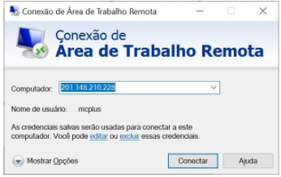
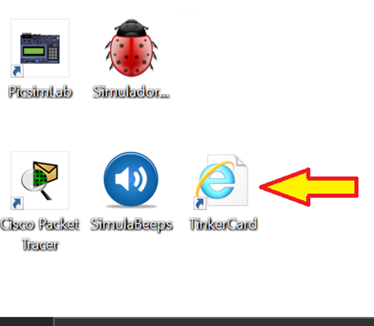
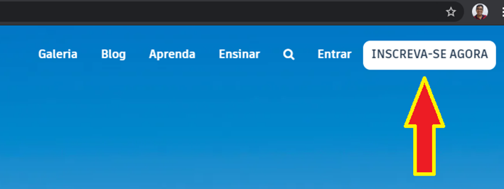
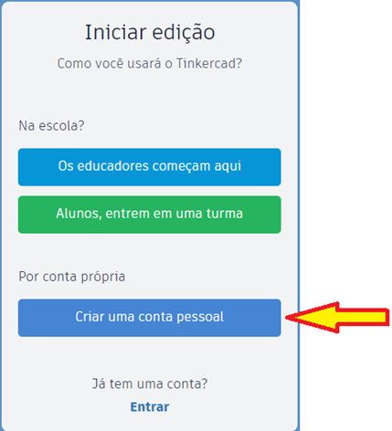
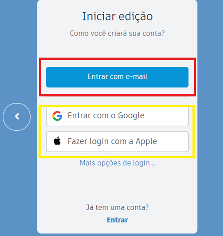
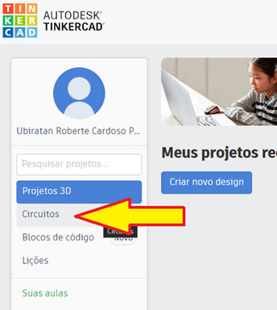
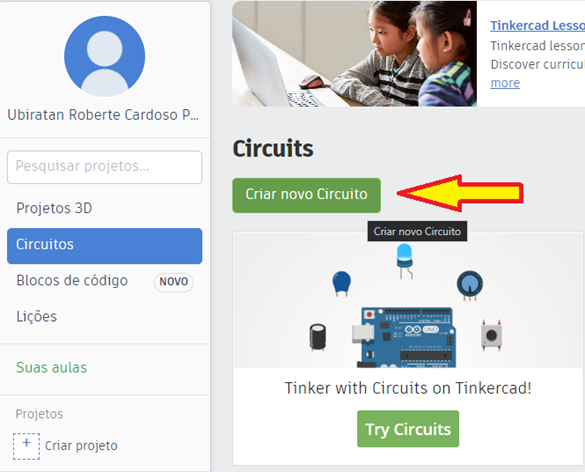
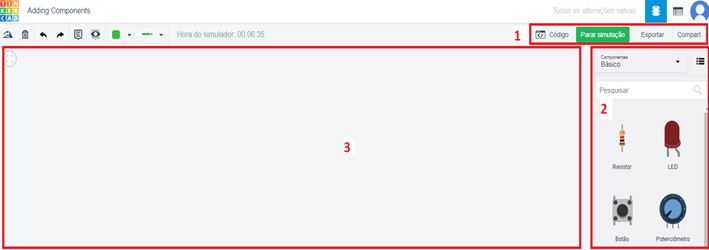

# O Hardware dos Microcontroladores
- 5 Vídeos
- 1 Texto
- 6 Questões
- 1 Atividade Prática

## Interação com Sensores e Atuadores 📝
**Objetivos:** Permitir que o aluno tenha melhor compreensão da relação existente entre o software e o hardware, e melhorar seu entendimento sobre o uso dos registradores 
**Materiais, Métodos e Ferramentas:** Para realizar essa prática o aluno precisará somente de um computador com acesso a internet, ao ambiente remoto da Descomplica e ao e uma conta no aplicativo web Tinkercard. O acesso também pode ser feito a partir de qualquer outro dispositivo pessoal

**Leia atentamente o texto a seguir.**

Com a evolução dos microprocessadores, e consequentemente a evolução dos computadores, surgiu a necessidade do desenvolvimento de placas controladoras de arquitetura mais simples, com recursos reduzidos, projetadas especificamente para operações de controle de dispositivos que exigem menos poder de processamento e capacidade de armazenamento 
Esses dispositivos, conhecidos como microcontroladores, são dispositivos computacionais desenvolvidos especificamente para realização de tarefas triviais, geralmente controle de impressoras e demais periféricos, além de circuitos menos complexos 
Os microcontroladores permitem inclusive, através do uso de sensores e atuadores, o desenvolvimento de aplicações que mantêm relação com o ambiente externo, e com esses recursos é possível até mesmo desenvolver equipamentos de controle residencial entre outros. Para realizar a atividade, você deverá ter acesso a ferramenta web Tinkercard, o acesso pode ser feito pelo ambiente remoto da Descomplica ou de qualquer outro computador, tablet ou smartphone com acesso a internet 
Caso deseje acessar o Tinkercard de um computador próprio, acesse o endereço web https://www.tinkercad.com/ e siga diretamente para o 3º passo

**1º. Passo) Acesse a Área de Trabalho Remota Descomplica, para isso clique em conectar.**
**Observação:** o endereço IP do computador remoto pode passar por atualização. Certifique-se com o professor tutor

**2º. Passo) Abra a ferramenta: Tinkercard**

**3º. Passo) Conhecendo o Ambiente:** Ao abrir o aplicativo, imediatamente será apresentada uma tela semelhante a que é apresentada na ilustração abaixo. Nesse momento será necessário realizar o cadastro no ambiente

Caso você não tenha cadastro na ferramenta, então clique no botão **INSCREVER-SE AGORA**. Ao fazer isso, a seguinte tela será exibida. Caso já tenha uma conta, clique em **Entrar**
Clicando em **INSCREVER-SE AGORA**, você será direcionado para uma tela semelhante a que é apresentada a seguir

Ao clicar no botão **Criar uma conta pessoal**, você será direcionado para uma tela semelhante à que é apresentada a seguir. Agora você tem a opção de criar uma nova conta utilizando seu Login Google, ou Login Apple ou criar uma nova conta usando seu e-mail

Criada a conta, basta então realizar o login. Após o login, você será direcionado para o **Dashboard**

Na tela do dashboard, clique no item **circuitos**. Ao fazer isso você será redirecionado para uma tela semelhante à apresentada na figura a seguir

Na tela que será exibida, clique em **Try Circuits**. Feito isso, você será direcionado para a tela inicial do projeto do circuito

Sendo que no **campo 1** podemos iniciar a simulação e também inserir códigos, caso seja necessário. No **campo 2** é possível escolher os componentes que serão usados no circuito. Por fim, a área apresentada pelo **campo 3** é a área na qual se pode construir o circuito

**4º. Passo) Resolvendo a atividade:** Agora que conhecemos o ambiente, é hora de compreendermos a atividade 
Nesse momento o que queremos é realizar uma atividade simples cujo o principal propósito é compreender que sensores e atuadores podem atuar tanto com sinais analógicos quanto digitais 
Para que possamos praticar esse entendimento, criaremos um circuito que ascenderá um conjunto de LED 's. Contudo, a força de iluminação de cada LED deverá variar de acordo com com a iluminação do local 
Para essa atividade sugiro utilizar: **uma bateria de 9v, uma placa de ensaio pequena, um sensor de luz ambiente e alguns LED 's**