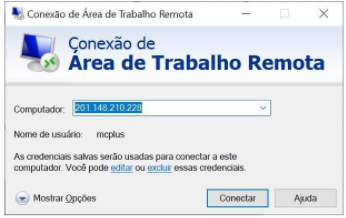
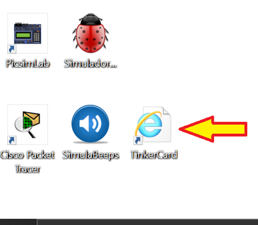
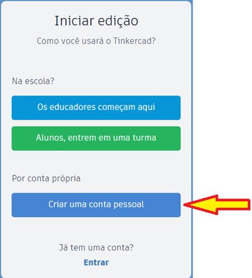
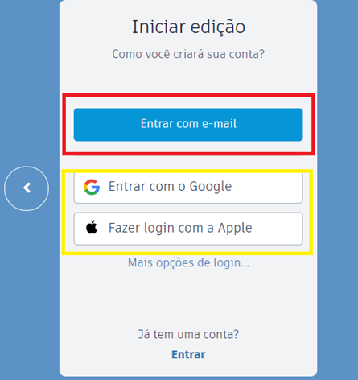
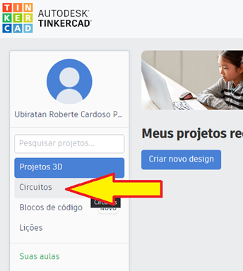
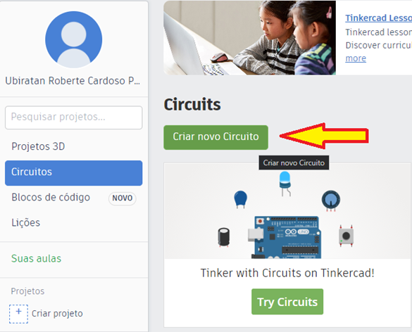
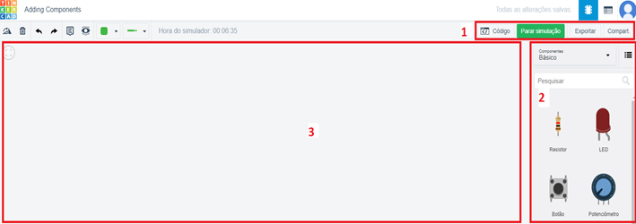
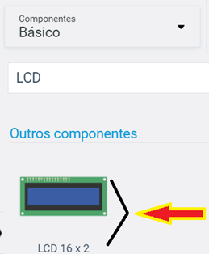

# Programação em Microcontroladores
- 5 Vídeos
- 1 Texto
- 6 Questões
- 1 Atividade Prática

## Criando e programando circuitos com Arduino 📝
**Objetivos:** Permitir que o aluno pratique os conceitos relacionados a programação de microcontroladores aprendidos durante a aula, elaborando e simulando circuitos que podem ser reconstruídos com equipamentos reais 
**Materiais, Métodos e Ferramentas:** Para realizar essa prática o aluno precisará somente de um computador com acesso a internet, ao ambiente remoto da Descomplica e ao e uma conta no aplicativo web Tinkercard. O acesso também pode ser feito a partir de qualquer outro dispositivo pessoal

**Leia atentamente o texto a seguir.**

O avanço da tecnologia e dos microprocessadores permitiu que os computadores, tantos pessoais, quanto científicos, mainframes, servidores, etc, se tornassem cada vez mais robustos, potentes e baratos - quanto comparamos realizamos a relação custo por bit, ou custo por Hz ou Mhz 
Entretanto, para diversos casos, esses equipamentos ou componentes de hardware podem ser considerados “exagerados”, com excesso de potência e consequentemente caros demais para muitas finalidades, geralmente simples e triviais 
Muitas dessas atividades consideradas triviais podem ser realizadas por dispositivos mais simples, com menor poder de processamento, e mínima capacidade de armazenamento, suficiente somente para armazenar um programa simples que será responsável por alguma lógica necessária para a atividade para a qual o dispositivo está sendo desenvolvido 
Para realizar a atividade, você deverá ter acesso a ferramenta web Tinkercard, o acesso pode ser feito pelo ambiente remoto da Descomplica ou de qualquer outro computador, tablet ou smartphone com acesso a internet 
Caso deseje acessar o Tinkercard de um computador próprio, acesse o endereço web https://www.tinkercad.com/ e siga diretamente para o 3º passo

**1º. Passo) Acesse a Área de Trabalho Remota Descomplica, para isso clique em conectar.** 
**Observação:** o endereço IP do computador remoto pode passar por atualização. Certifique-se com o professor tutor

**2º. Passo) Abra a ferramenta:** Tinkercard

**3º. Passo) Conhecendo o Ambiente:** Ao abrir o aplicativo, imediatamente será apresentada uma tela semelhante a que é apresentada na ilustração abaixo. Nesse momento será necessário realizar o cadastro no ambiente

Caso você não tenha cadastro na ferramenta, então clique no botão **INSCREVER-SE AGORA**. Ao fazer isso, a seguinte tela será exibida. Caso já tenha uma conta, clique em **Entrar**
Clicando em **INSCREVER-SE AGORA**, você será direcionado para uma tela semelhante a que é apresentada a seguir

Ao clicar no botão **Criar uma conta pessoal**, você será direcionado para uma tela semelhante à que é apresentada a seguir. Agora você tem a opção de criar uma nova conta utilizando seu Login Google, ou Login Apple ou criar uma nova conta usando seu e-mail

Criada a conta, basta então realizar o login. Após o login, você será direcionado para o **Dashboard**

Na tela do dashboard, clique no item **circuitos**. Ao fazer isso você será redirecionado para uma tela semelhante à apresentada na figura a seguir

Na tela que será exibida, clique em **Try Circuits**. Feito isso, você será direcionado para a tela inicial do projeto do circuito

Sendo que no **campo 1** podemos iniciar a simulação e também inserir códigos, caso seja necessário. No **campo 2** é possível escolher os componentes que serão usados no circuito. Por fim, a área apresentada pelo **campo 3** é a área na qual se pode construir o circuito

**4º. Passo) Resolvendo a atividade:** Agora que conhecemos o ambiente, é hora de compreendermos a atividade. 
Nessa atividade seu propósito será não somente a de construir um circuito, mas também de programar o referido circuito

O circuito que deverá construir e programar será simples, será composto de uma placa Arduino, um LCD 16x2 e uma placa de ensaio pequena 
Para essa atividade sugiro utilizar um **componente LCD**. A imagem a seguir pode ajudar com isso

